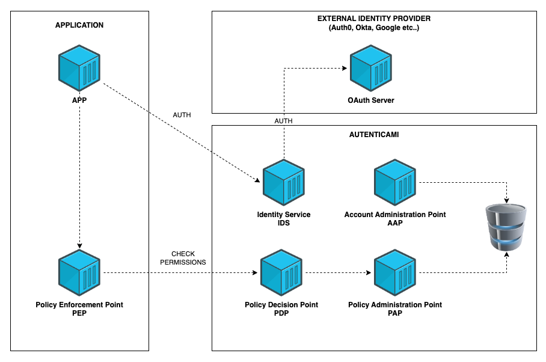

# Architecture and Concepts

`Autenticami` is composed of several components.

- **Identity Service (IDS):** The IDS takes care of exchanging the third-party token with an autenticami token. Through this service it is possible to assume a role identity.
- **Policy Decision Point (PDP):** The PDP is responsible for evaluating policies and deciding whether an identity can perform an action. Policies are retrieved through the PAP.
- **Policy Administration Point (PAP):** The PAP is responsible for managing and distributing policies.
- **Account Administration Point (AAP):** The AAP is responsible for account and project management.
- **Policy Enforcement Point (PEP):** The PEP is responsible for enforcing policies.

!!! info "INFO"
    Identity Service has to be configured with a plugin that implements the integration with an external identity provider.

## Applicative Flow

An authentication-based application flow can be summarized with the following steps:

- The Developer configures the Application and its Projects using the AAP.
- The Application autenticates with the external identity provider by the means of the IDS.
- The IDS swaps the external token with an autenticami token.
- Optionally the application can assume a role by the means of the IDS.
- The Application use an Autenticami SDK to act as a PEP and check the permissions with the PDP.
- The PDP retrieves policies and attributes from the PAP.

!!! info "INFO"
    If the application has already been authenticated with the external identity provider it is possible just to swap the token with the Identity Service.

The following diagram shows the applicative flow of an application using `Autenticami`.

