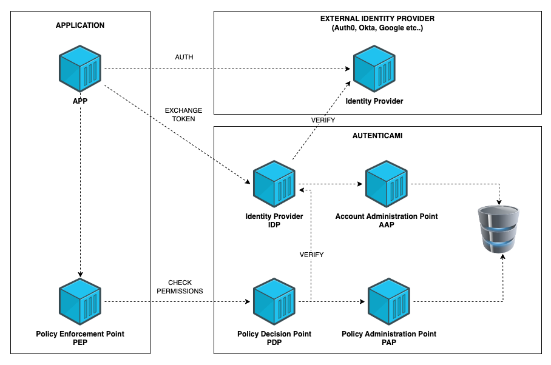

# Concepts

`Autenticami` is composed of several components.

- **Identity Service (IDS):** The IDS takes care of exchanging the third-party token with an autenticami token. Through this service it is possible to assume a role identity.
- **Policy Decision Point (PDP):** The PDP is responsible for evaluating policies and deciding whether an identity can perform an action. Policies are retrieved through the PAP.
- **Policy Administration Point (PAP):** The PAP is responsible for managing and distributing policies.
- **Account Administration Point (AAP):** The AAP is responsible for account and project management.
- **Policy Enforcement Point (PEP):** The PEP is responsible for enforcing policies.

!!! info "INFO"
    Identity Service has to be configured with a plugin that implements the integration with an external identity provider.

## Applicative Flow

An authentication-based application flow can be summarized with the following steps:

- The Developer configures the Account and its Projects using the AAP.
- The Application autenticates with the external identity and swaps the external token with an autenticami token.
- Optionally the application can assume a role by the means of the IDS.
- The Application use an Autenticami SDK to act as a PEP and check the permissions with the PDP.
- The PDP retrieves policies and attributes from the PAP.
- The PEP evaluates the policies and attributes and decides whether the identity can perform the action.

The following diagram shows the applicative flow of an application using `Autenticami`.

